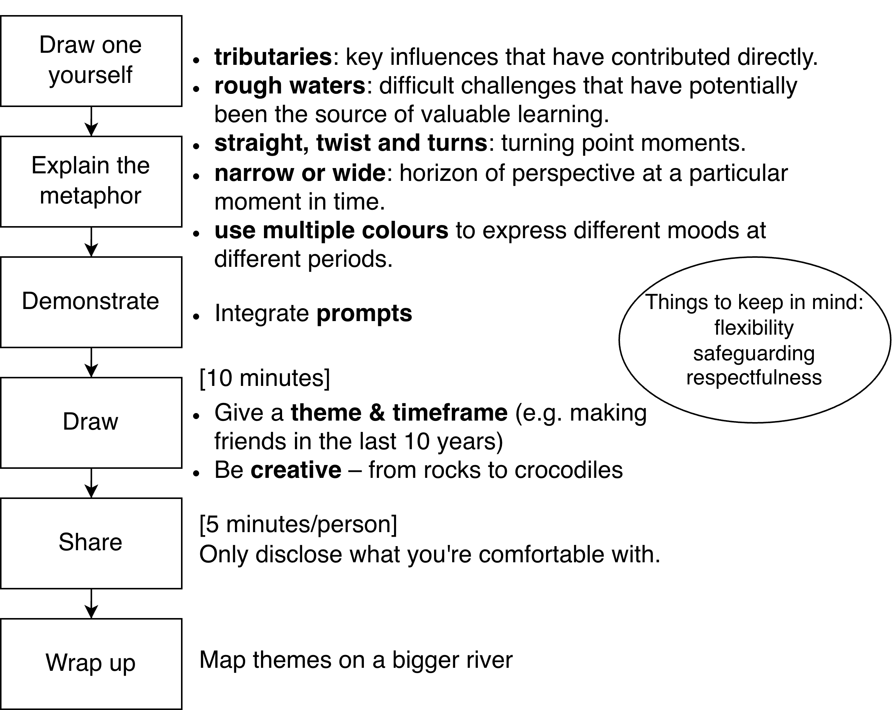
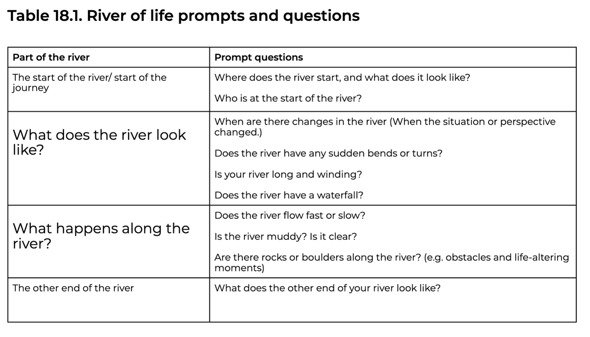

## What is River of Life?

River of Life is a tool that visualises individual’s experience with a ‘river’ metaphor. Participants are encouraged to draw a river with these key elements – river of life (key stages), tributaries (positive experiences), and rough waters (difficult challenges). After drawing the river, participants will be asked to share their own river with others.

## Material

1.  Multicoloured paper
2.  Coloured markers, crayons, and pen
3.  flipchart (optional)
4.  Magazines, scissors, glue (optional)

## Steps

Figure made based on Moussa (2009), Howard (2023) and Carmody (2023)

## Useful Prompts

(From Carmody, 2023)

## What we might need to think about & next steps:

1.  Whether it should be held as focus groups or individual interviews
2.  Visualise and simplify prompts and steps

## References

Carmody, S. (2023). River of life storytelling. In Qualitative Research – a practical guide for health and social care researchers and practitioners (pp. 128–134). Monash University.

Howard, J. (2023). Practical Guides for Participatory Methods: Rivers of Life. The Institute of Development Studies and Partner Organisations.https://hdl.handle.net/20.500.12413/17839

Moussa. (2009). Rivers of life. In Community-based adaptation to climate change.
